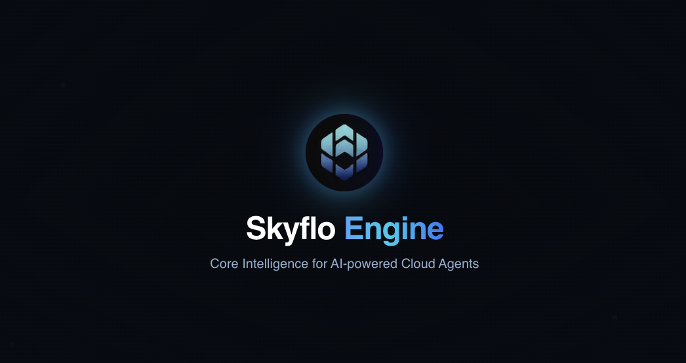

# Engine

<p align="center">
  
</p>

<div align="center">

  [](https://skyflo.ai)
  [](https://discord.gg/kCFNavMund)
  [](https://x.com/skyflo_ai)
  [](https://www.youtube.com/@SkyfloAI)
  [](LICENSE)
</div>

## Core Intelligence for AI-powered Cloud Agents

The Skyflo Engine is the brain behind our AI agents, powering natural language interactions with cloud infrastructure. It combines advanced LLM capabilities with deep cloud expertise to enable intuitive infrastructure management.

## Key Features

- **Intelligent Workflow Orchestration**: Temporal-based workflow management for reliable agent operations
- **Knowledge Graph Integration**: Neo4j-powered resource relationship mapping and querying
- **LLM Integration Layer**: Advanced prompt engineering and context management
- **Real-time Resource Processing**: Efficient handling of cloud resource updates
- **Security-First Architecture**: Built-in security controls and audit capabilities

## Architecture

The engine consists of several core components:

- **Workflow Engine**: Temporal-based workflow orchestration
- **Knowledge Store**: Neo4j graph database for resource relationships
- **LLM Controller**: Manages interactions with language models
- **Resource Processor**: Handles cloud resource data processing
- **Security Layer**: Implements access controls and audit logging

## Tech Stack

- **Core**: Python
- **Workflow**: Temporal
- **AI/ML**: LangChain
- **Database**: Neo4j, PostgreSQL
- **Message Queue**: Redis
- **Monitoring**: Prometheus, Grafana

## Getting Started

### Prerequisites

- Python 3.9+
- Docker and Docker Compose
- Neo4j 5.x
- PostgreSQL 14+
- Redis 6+

### Local Development Setup

1. Clone the repository:
   ```bash
   git clone https://github.com/skyflo-ai/engine.git
   cd engine
   ```

2. Create and activate virtual environment:
   ```bash
   python -m venv venv
   source venv/bin/activate  # On Windows: .\venv\Scripts\activate
   ```

3. Install dependencies:
   ```bash
   pip install -r requirements.txt
   ```

4. Set up environment variables:
   ```bash
   cp .env.example .env
   # Edit .env with your configuration
   ```

5. Start required services:
   ```bash
   docker-compose up -d
   ```

6. Run development server:
   ```bash
   python -m skyflo.engine
   ```

## Documentation

- [Architecture Overview](https://github.com/skyflo-ai/skyflo/blob/main/docs/architecture.md)
- [API Reference](https://github.com/skyflo-ai/skyflo/blob/main/docs/api.md)

## Contributing

We welcome contributions! Please see our [Contributing Guide](CONTRIBUTING.md) for details.

### Development Process

1. Fork the repository
2. Create your feature branch (`git checkout -b feature/amazing-feature`)
3. Commit your changes (`git commit -m 'Add amazing feature'`)
4. Push to the branch (`git push origin feature/amazing-feature`)
5. Open a Pull Request

## License

This project is licensed under the Business Source License 1.1 - see the [LICENSE](LICENSE) file for details.

## Community

- [Discord](https://discord.gg/kCFNavMund)
- [Twitter/X](https://x.com/skyflo_ai)
- [YouTube](https://www.youtube.com/@SkyfloAI)
- [GitHub Discussions](https://github.com/skyflo-ai/skyflo/discussions)

## Support

- Documentation: [docs.skyflo.ai](https://docs.skyflo.ai)
- Issues: [GitHub Issues](https://github.com/skyflo-ai/engine/issues)
- Enterprise Support: [enterprise@skyflo.ai](mailto:enterprise@skyflo.ai)
